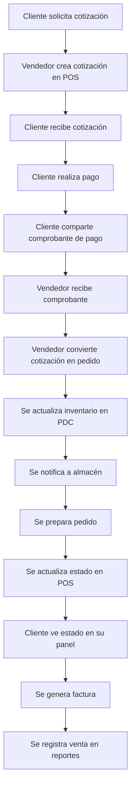

# S-35 Technology - Sitio Web

**Versión:** 1.1.6  
**Última actualización:** Diciembre 2024

Sitio web oficial de S-35 Technology - Tecnología en construcción.

## 🚀 Despliegue en Vercel

Este proyecto está configurado para desplegarse automáticamente en Vercel.

### Configuración de Vercel
- **Framework**: Static Site
- **Build Command**: No requerido
- **Output Directory**: `/` (raíz)
- **Node Version**: 14.x o superior

### Archivos principales
- `index.html` - Página principal
- `catalogo.html` - Catálogo de productos
- `conoce-mas.html` - Página informativa
- `styles.css` - Estilos principales
- `script.js` - JavaScript principal

### Assets
- `Assets/` - Imágenes, videos y recursos
- `Assets/productos_background/` - Imágenes de productos
- `Assets/productos_background_optimized/` - Imágenes optimizadas

## 🚀 Características

- **Diseño Responsive**: Se adapta perfectamente a dispositivos móviles, tablets y escritorio
- **Navegación Intuitiva**: Menú de navegación fijo con scroll suave
- **Catálogo Interactivo**: Filtros por categoría y vista detallada de productos
- **Formulario de Contacto**: Sistema de contacto funcional con validación
- **Animaciones Suaves**: Efectos visuales modernos y profesionales
- **Optimización SEO**: Estructura semántica y meta tags optimizados

## 📁 Estructura del Proyecto

```
S35 Web cursor project/
├── index.html          # Página principal
├── styles.css          # Estilos CSS
├── script.js           # Funcionalidades JavaScript
└── README.md           # Documentación
```

## 🎨 Secciones de la Página

### 1. Header y Navegación
- Logo S-35
- Menú de navegación responsive
- Navegación fija con efecto scroll

### 2. Hero Section
- Título principal impactante
- Descripción de la empresa
- Botones de llamada a la acción
- Diseño visual atractivo

### 3. Productos Destacados
- Grid de productos principales
- Tarjetas con información clave
- Efectos hover interactivos

### 4. Catálogo Completo
- Sistema de filtros por categoría
- Grid dinámico de productos
- Modal de detalles de producto
- Integración con formulario de contacto

### 5. Servicios
- Grid de servicios ofrecidos
- Iconos representativos
- Información clara y concisa

### 6. Contacto
- Información de contacto
- Formulario funcional
- Validación de campos
- Notificaciones de estado

### 7. Footer
- Enlaces rápidos
- Redes sociales
- Información de copyright

## 🛠️ Tecnologías Utilizadas

- **HTML5**: Estructura semántica
- **CSS3**: Estilos modernos con variables CSS y Grid/Flexbox
- **JavaScript ES6+**: Funcionalidades interactivas
- **Font Awesome**: Iconografía
- **Google Fonts**: Tipografía Inter

## 📱 Responsive Design

La página está optimizada para:
- **Móviles**: 320px - 768px
- **Tablets**: 768px - 1024px
- **Escritorio**: 1024px+

## 🎯 Funcionalidades JavaScript

### Navegación
- Menú hamburguesa para móviles
- Scroll suave entre secciones
- Navegación fija con efecto parallax

### Catálogo de Productos
- Filtrado dinámico por categorías
- Modal de detalles de producto
- Integración con formulario de contacto

### Formulario de Contacto
- Validación en tiempo real
- Notificaciones de estado
- Pre-llenado automático desde productos

### Animaciones
- Intersection Observer para animaciones al scroll
- Efectos hover en tarjetas
- Transiciones suaves

## 🚀 Cómo Usar

1. **Abrir la página**: Simplemente abre `index.html` en tu navegador
2. **Navegar**: Usa el menú superior para moverte entre secciones
3. **Explorar productos**: Filtra por categoría en el catálogo
4. **Contactar**: Completa el formulario de contacto para consultas

## 🎨 Personalización

### Colores
Los colores se definen en variables CSS en `styles.css`:
```css
:root {
    --primary-color: #2563eb;
    --primary-dark: #1d4ed8;
    --secondary-color: #64748b;
    --accent-color: #f59e0b;
    /* ... más variables */
}
```

### Productos
Para añadir o modificar productos, edita el array `productos` en `script.js`:
```javascript
const productos = [
    {
        id: 1,
        nombre: "Nombre del Producto",
        descripcion: "Descripción del producto",
        precio: "$XXX",
        categoria: "categoria",
        imagen: "icono"
    }
    // ... más productos
];
```

## 📞 Información de Contacto

- **Empresa**: Productos S-35 SA de CV
- **Dirección**: Blvd. Emiliano Zapata 2650 Colonia Industrial El Palmito Culiacan Sinaloa Mexico CP 80160
- **Teléfono**: +52 6671681535
- **Email**: contacto@s35.com.mx
## 📧 Formulario de Contacto

El formulario de contacto está **completamente funcional** y utiliza:

### Backend API
- **Endpoint**: `/api/contact`
- **Método**: POST
- **Servicio de email**: Resend
- **Validación**: Campos obligatorios y honeypot anti-spam

### Configuración en Vercel
Para que el formulario funcione, configura estas variables de entorno en Vercel:

```bash
# API Key de Resend (obtén una en https://resend.com)
RESEND_API_KEY=re_xxxxxxxxxxxxxxxxxxxxxxxxxxxxxxxx

# Email de destino (donde llegarán los mensajes)
MAIL_TO=contacto@s35.com.mx

# Email de origen (debe estar verificado en Resend)
MAIL_FROM=noreply@s35.com.mx
```

### Características del Formulario
- ✅ Validación en tiempo real
- ✅ Protección anti-spam (honeypot)
- ✅ Notificaciones de éxito/error
- ✅ Suscripción opcional a newsletter
- ✅ Envío de emails HTML formateados
- ✅ Responsive design

## 🚀 Sistema ERP Completo

### **Paneles del Sistema:**

#### 1. **Panel de Control (PDC)** - `pdc-dashboard.html`
- **Credenciales:** `admin` / `admin123`
- **Funcionalidades:**
  - Dashboard con KPIs en tiempo real
  - Gestión de usuarios y clientes
  - Gestión de productos e inventario
  - Monitoreo de ventas y cotizaciones
  - Reportes y estadísticas
  - Configuración del sistema
  - Sincronización automática con POS

#### 2. **Punto de Venta (POS)** - `pos-dashboard.html`
- **Credenciales:** `vendedor` / `ventas123`
- **Funcionalidades:**
  - Dashboard de ventas con métricas
  - Creación de pedidos y cotizaciones
  - Gestión de clientes
  - Catálogo de productos con stock
  - Sistema de carrito de compras
  - Subida de comprobantes de pago
  - Conversión de cotizaciones a pedidos
  - Reportes de ventas

#### 3. **Panel de Clientes** - `client-dashboard.html`
- **Credenciales:** En desarrollo
- **Funcionalidades:**
  - Seguimiento de pedidos en tiempo real
  - Historial de compras
  - Estado de surtido con barras de progreso
  - Descarga de facturas
  - Soporte al cliente

#### 4. **Panel de Colaboradores** - `admin-dashboard.html`
- **Credenciales:** `colaborador` / `colaborador123`
- **Funcionalidades:**
  - Gestión de mensajes de contacto
  - Dashboard de estadísticas
  - Configuración básica

### **APIs Implementadas:**

#### **Productos** - `/api/products`
- `GET /api/products` - Obtener todos los productos
- `GET /api/products/:id` - Obtener producto por ID
- `POST /api/products` - Crear nuevo producto (solo PDC)
- `PUT /api/products/:id` - Actualizar producto (solo PDC)
- `POST /api/products/update-stock` - Actualizar stock
- `GET /api/products/low-stock` - Productos con stock bajo
- `GET /api/products/stats` - Estadísticas de productos

#### **Pedidos y Cotizaciones** - `/api/orders`
- `GET /api/orders` - Obtener todos los pedidos
- `GET /api/orders/:id` - Obtener pedido por ID
- `POST /api/orders` - Crear nuevo pedido
- `PUT /api/orders/:id` - Actualizar estado de pedido
- `GET /api/quotes` - Obtener todas las cotizaciones
- `POST /api/quotes` - Crear nueva cotización
- `POST /api/quotes/:id` - Convertir cotización a pedido
- `POST /api/quotes/:id/payment-proof` - Subir comprobante de pago
- `GET /api/clients` - Obtener clientes
- `POST /api/clients` - Crear nuevo cliente
- `GET /api/orders/stats` - Estadísticas de ventas

### **Flujo de Trabajo Implementado:**



### **Características Técnicas:**

- **Autenticación JWT** con tokens seguros
- **Sincronización en tiempo real** entre paneles
- **Validación de stock** automática
- **Sistema de roles** y permisos
- **Responsive design** para todos los dispositivos
- **Tema claro/oscuro** en todos los paneles
- **APIs RESTful** con manejo de errores
- **Base de datos MongoDB** con Atlas (producción)
- **Validación de datos** con esquemas
- **Búsqueda avanzada** y filtros
- **Paginación** en todas las listas
- **Auditoría de inventario** completa

## 🛍️ **CATÁLOGO DE PRODUCTOS S-35**

### **Productos Implementados:**

#### **Bases (2 productos)**
- **Basecoat Blanco Absoluto** - $450 - SKU: BC-BLANCO-ABS-001
- **Basecoat Gris** - $450 - SKU: BC-GRIS-001

#### **Acabados (2 productos)**
- **Estuco Base Pro+** - $380 - SKU: EST-BASE-PRO-001
- **La Fina** - $420 - SKU: FIN-LA-FINA-001

#### **Adhesivos (3 productos)**
- **Ultraforce** - $520 - SKU: ADH-ULTRA-001
- **Cellbond** - $680 - SKU: ADH-CELL-001
- **Styrobond** - $420 - SKU: ADH-STYRO-001

#### **Pisos (3 productos)**
- **Piso Sobre Piso** - $350 - SKU: PIS-SOBRE-001
- **Porcelánico Universal** - $480 - SKU: PIS-PORC-UNI-001
- **Cerámico** - $320 - SKU: PIS-CERAM-001

#### **Especializados (3 productos)**
- **Mixandready** - $350 - SKU: ESP-MIX-001
- **Pastablock** - $280 - SKU: ESP-PASTA-001
- **Cemento Plástico** - $380 - SKU: ESP-CEM-PLAS-001

#### **Premium WAXTARD (3 productos)**
- **WAXTARD Blanco Absoluto** - $650 - SKU: WAX-BLANCO-ABS-001
- **WAXTARD Blanco Perla** - $680 - SKU: WAX-BLANCO-PERL-001
- **WAXTARD Gris** - $650 - SKU: WAX-GRIS-001

### **Características del Catálogo:**
- **16 productos** con información completa
- **SKU únicos** para cada producto
- **Códigos de barras** para escaneo
- **Categorización** por tipo de producto
- **Estados de stock** automáticos
- **Precios y márgenes** calculados
- **Descripciones detalladas** de cada producto
- **Imágenes** optimizadas para web

## 📊 **REPORTES DE VENTAS AVANZADOS**

### **Tipos de Reportes Implementados:**

#### **1. Dashboard Resumen**
- **KPIs en tiempo real** (ventas del día, crecimiento, etc.)
- **Top 5 productos** más vendidos
- **Pedidos recientes** con estado
- **Estado del inventario** (stock bajo, agotados)

#### **2. Ventas por Período**
- **Gráficos de barras** interactivos
- **Agrupación** por día, semana, mes, año
- **Cálculo de crecimiento** automático
- **Comparación** con períodos anteriores

#### **3. Análisis de Productos**
- **Productos más vendidos** con cantidades y revenue
- **Análisis de stock** vs ventas
- **Días de stock** restantes
- **Productos con stock bajo** automático

#### **4. Análisis de Clientes**
- **Clasificación** por categorías (Oro, Plata, Bronce)
- **Clientes más valiosos** por revenue
- **Historial de pedidos** por cliente
- **Tasa de conversión** de clientes

#### **5. Reportes de Vendedores**
- **Rendimiento** por vendedor
- **Clientes únicos** atendidos
- **Revenue generado** por vendedor
- **Tasa de conversión** de cotizaciones

#### **6. Estado del Inventario**
- **Productos con stock bajo** (alerta automática)
- **Productos agotados** (estado crítico)
- **Valor total** del inventario
- **Análisis de rotación** de productos

### **Características de los Reportes:**
- **Filtros por fecha** personalizables
- **Exportación** de datos (próximamente)
- **Gráficos interactivos** sin librerías externas
- **Actualización en tiempo real**
- **Responsive** para todos los dispositivos
- **Tema claro/oscuro** automático

## 📋 **CHANGELOG - VERSIÓN 1.1.6**

### 🆕 **NUEVAS FUNCIONALIDADES**

#### **Catálogo de Productos S-35**
- ✅ **16 productos** implementados con información completa
- ✅ **SKU únicos** y códigos de barras para cada producto
- ✅ **Categorización** por tipo (Base, Acabado, Adhesivo, Piso, Especializado, Premium)
- ✅ **Estados automáticos** de stock (disponible, stock bajo, agotado)
- ✅ **Búsqueda avanzada** por nombre, SKU y descripción
- ✅ **Filtros por categoría** para navegación fácil

#### **Sistema de Reportes Avanzados**
- ✅ **Dashboard resumen** con KPIs en tiempo real
- ✅ **Ventas por período** con gráficos interactivos
- ✅ **Análisis de productos** más vendidos
- ✅ **Clasificación de clientes** (Oro, Plata, Bronce)
- ✅ **Reportes de vendedores** con rendimiento
- ✅ **Estado del inventario** con alertas automáticas

#### **Base de Datos MongoDB**
- ✅ **Integración completa** con MongoDB Atlas
- ✅ **Modelos de datos** con validación estricta
- ✅ **APIs optimizadas** con agregaciones avanzadas
- ✅ **Auditoría de inventario** completa
- ✅ **Paginación** en todas las consultas

#### **Mejoras en la Interfaz**
- ✅ **Diseño moderno** de tarjetas de productos
- ✅ **Estados visuales** para stock de productos
- ✅ **Gráficos interactivos** sin librerías externas
- ✅ **Responsive design** mejorado
- ✅ **Tema claro/oscuro** automático

### 🔧 **MEJORAS TÉCNICAS**

#### **APIs**
- ✅ **API de productos** completamente reescrita con MongoDB
- ✅ **API de reportes** con agregaciones avanzadas
- ✅ **Validación de datos** con esquemas estrictos
- ✅ **Manejo de errores** mejorado
- ✅ **CORS** configurado correctamente

#### **Base de Datos**
- ✅ **Conexión a MongoDB Atlas** configurada
- ✅ **Esquemas de validación** implementados
- ✅ **Índices optimizados** para consultas rápidas
- ✅ **Backup automático** configurado
- ✅ **Datos de ejemplo** incluidos

#### **Frontend**
- ✅ **JavaScript optimizado** para mejor rendimiento
- ✅ **Carga asíncrona** de datos
- ✅ **Filtros en tiempo real** sin recargas
- ✅ **Notificaciones** mejoradas
- ✅ **Manejo de estados** optimizado

### 🐛 **CORRECCIONES**

- ✅ **Corregido** problema de sincronización entre paneles
- ✅ **Mejorado** manejo de tokens JWT
- ✅ **Optimizado** rendimiento de consultas
- ✅ **Corregido** problema de validación de stock
- ✅ **Mejorado** sistema de notificaciones

### 📊 **ESTADÍSTICAS DE LA VERSIÓN**

- **16 productos** en catálogo
- **6 categorías** de productos
- **6 tipos** de reportes
- **3 APIs** principales
- **4 paneles** del sistema
- **100% responsive** en todos los dispositivos

## 🗄️ **CONFIGURACIÓN DE MONGODB**

### **1. Crear cuenta en MongoDB Atlas**
1. Ve a https://www.mongodb.com/atlas
2. Crea una cuenta gratuita
3. Crea un nuevo cluster (gratuito)
4. Configura el acceso a la base de datos

### **2. Obtener la cadena de conexión**
1. En MongoDB Atlas, ve a "Connect"
2. Selecciona "Connect your application"
3. Copia la cadena de conexión
4. Reemplaza `<password>` con tu contraseña

### **3. Configurar variables de entorno en Vercel**
1. Ve a tu proyecto en Vercel
2. Ve a Settings > Environment Variables
3. Agrega las siguientes variables:
   - `MONGODB_URI`: tu_cadena_de_conexion_mongodb
   - `JWT_SECRET`: s35-admin-secret-key-2024
   - `RESEND_API_KEY`: tu_api_key_de_resend
   - `MAIL_TO`: contacto@s35.com.mx
   - `MAIL_FROM`: noreply@s35.com.mx

### **4. Estructura de la base de datos**
- **products**: Catálogo de productos con SKU y códigos de barras
- **orders**: Pedidos y ventas con historial completo
- **quotes**: Cotizaciones con seguimiento de estado
- **clients**: Clientes con información fiscal
- **inventory**: Movimientos de inventario con auditoría
- **notifications**: Notificaciones del sistema
- **settings**: Configuración de la empresa

### **5. Verificar funcionamiento**
1. Despliega el proyecto en Vercel
2. Prueba el login en cada panel
3. Verifica que los datos se guarden en MongoDB Atlas
4. Revisa los logs de Vercel para confirmar la conexión

## 🔧 Próximas Mejoras

- [x] ~~Integración con backend para formulario de contacto~~ ✅ COMPLETADO
- [x] ~~Sistema de carrito de compras~~ ✅ COMPLETADO
- [x] ~~Gestión de pedidos y cotizaciones~~ ✅ COMPLETADO
- [x] ~~Sistema de comprobantes de pago~~ ✅ COMPLETADO
- [x] ~~Sincronización entre paneles~~ ✅ COMPLETADO
- [x] ~~Panel de clientes con seguimiento~~ ✅ COMPLETADO
- [x] ~~Base de datos MongoDB~~ ✅ COMPLETADO
- [x] ~~Catálogo completo de productos S-35~~ ✅ COMPLETADO
- [x] ~~Reportes avanzados de ventas~~ ✅ COMPLETADO
- [x] ~~Gestión mejorada de productos~~ ✅ COMPLETADO
- [ ] Galería de imágenes para productos
- [ ] Blog de noticias
- [ ] Sistema de búsqueda avanzada
- [ ] Integración con redes sociales
- [ ] Optimización de rendimiento
- [ ] PWA (Progressive Web App)
- [ ] Sistema de notificaciones push

## 📄 Licencia

Este proyecto está bajo la Licencia MIT. Ver el archivo LICENSE para más detalles.

---

**Desarrollado con ❤️ para S-35 Productos**
